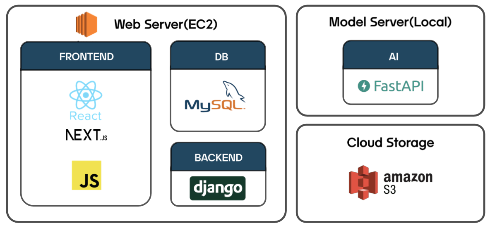

# Voice Verity
__Deep Voice Classification API Service Development Project__

## Project Overview

With the advancement of generative AI technology, voice cloning technology and market are also expanding. Synthetic voices generated through this voice cloning technology can closely mimic real human voices, extending their application range to various fields such as finance, telecommunications, and entertainment, including KT's "AI Voice Studio", SM Entertainment's "aespa virtual member ae-Aespa", and Bixby's "Bixby Voice Creator".

However, crimes such as phishing and copyright infringement using synthetic voices are also increasing. These synthetic voices can be misused for phone scams or financial fraud phishing attacks, and cases of copyright infringement by impersonating someone else's voice can also occur. To prevent the abuse of this technology, it is necessary to strengthen legal regulations and technical defense systems, and it is also important to widely disseminate methods for identifying synthetic voices through user education. Continuous monitoring and management are required to ensure that voice synthesis technology is used safely and responsibly.

Additionally, there are currently insufficient countermeasures against synthetic voices known as deep voices. People are responding by not answering unknown calls, verifying authenticity, and contacting the police, but these are only temporary solutions. These methods are not perfect and have limitations in preventing actual damage. Therefore, it is necessary to establish systematic and technical defense systems and legal regulations, and user awareness and education also play a crucial role.

Thus, we aim to develop a service that detects deep voices, not to make people cautious, but to inform them to prevent victimization from crimes. This service will help detect synthetic voices in real time and provide warnings to users, helping prevent potential risks. This way, people can use technology more safely.

### Technical Approach
This project utilizes three main technologies to detect deep fake voices:
1. **RVC Model**: Generates synthetic voices reflecting various demographic characteristics through voice conversion.
2. **Vocal Remover Model**: Uses an autoencoder-based model to remove background noise from voice data and extract only human voices.
3. **ViT Model**: Detects deep fake voices by converting voice data into mel-spectrogram images using the Vision Transformer.

## Project Objectives

The main objective of this project is to develop an accurate and reliable classifier capable of detecting deep voices. To achieve this, we will deploy advanced AI models. Specifically, we aim to distinguish between real and synthetic voices using the RVC (Retrieval-based Voice Conversion) model for generating deep voices, the Vocal Remover model for separating speaker voices and background noise, and the Vision Transformer (ViT) model for classifying real and synthetic voices.

### Performance Objectives
The performance objectives of this project are as follows:
1. **Accuracy**: Achieve a deep fake voice detection accuracy of over 98%.
2. **Real-time Processing**: Enable real-time detection with a latency of less than 1 minute.
3. **User Satisfaction**: Achieve over 90% user satisfaction based on feedback.

## Project Steps

1. Building a Korean deep voice dataset
2. Preprocessing voice data
3. Training the classification model
4. Implementing the web service
5. Deploying the model in API format

## 1. Building a Korean Deep Voice Dataset

Due to the lack of existing datasets containing Korean deep fake voices, we decided to create our own dataset. To this end, we pretrained Applio's open-source RVC Model to generate synthetic voices representing various demographics, including different genders, age groups, regional dialects, and speech characteristics.

Actual voice data was collected from AI Hub using data from four categories: "news scripts and anchor voices", "free conversation voices (mixed gender, children)", "free conversation voices (elderly, mixed gender)", and "free conversation voices (general public, mixed gender)", ensuring demographic diversity across gender, age groups, regional dialects, and speech characteristics, resulting in six clusters of actual voice data.

### Deep Voice Generation Process

1. **RVC Model Training**: Load the pretrained weights of the model supporting Korean and learn speech characteristics from the voice data of each speaker.
2. **Synthetic Voice Sample Acquisition**: Generate synthetic voice samples by inputting voice samples assigned differently to each speaker into the RVC model.
3. **Quality Control**: Select high-quality synthetic voice samples through qualitative quality control.

### Korean Deep Voice Dataset Volume

| Korean Deep Voice Dataset | Actual Voice | Synthetic Voice |
| ------ | --- | --- |
| Child (Male) | 120 | 92 |
| Child (Female) | 210 | 124 |
| Adult (Male) | 420 | 286 |
| Adult (Female) | 570 | 458 |
| Elderly (Male) | 150 | 127 |
| Elderly (Female) | 150 | 141 |
| Total | 1620 | 1554 |

## 2. Voice Data Preprocessing

Voice data preprocessing is a critical step to maximize the performance of model training. This process involves organizing collected actual and synthetic voice data and transforming it into a form that can be used for model training.

### Preprocessing Steps

1. **Noise Removal and Voice Extraction**: Use the autoencoder-based Vocal Remover model to extract human voices from audio signals. This model removes background noise from audio signals and secures clear voice data.
2. **Voice Segmentation**: Slice the extracted voice data into manageable audio clips at 1-second intervals. This process allows the model to effectively process smaller units of voice data.
3. **Format Conversion**: Convert each sliced audio clip into a mel-spectrogram. Mel-spectrograms visually represent voice data and contain frequency domain information, helping the model to better learn voice characteristics.

### Result After Preprocessing

Preprocessed voice data is prepared in an optimized form for model training. This preprocessed data is used in the next step of training the classification model, contributing to improving the model's performance and accuracy.

## 3. Classification Model Training

In the classification model training stage, we develop and train a model that can distinguish between real and deep fake voices using the preprocessed data. In this process, we utilize the Vision Transformer (ViT) model. The ViT model shows high performance in image classification tasks and can be effectively applied to voice classification tasks by converting voice data into mel-spectrograms.

### Vision Transformer (ViT) Model Description

The ViT model uses a different approach than traditional convolutional neural networks (CNNs) for image classification. It processes images using a transformer architecture, extending transformers, which are mainly used in natural language processing (NLP), to the image domain. ViT is innovative in various aspects, especially performing well on large-scale datasets.(https://arxiv.org/pdf/2010.11929)

#### Key Components of the ViT Model

1. **Patch Embedding**: Splits the input image (here, mel-spectrogram image) into fixed-size patches. For example, a 256x256 image is split into 16x16 patches, resulting in a total of 256 patches. Each patch is converted into a 1-dimensional vector.
2. **Position Embedding**: Encodes the position information of each patch since patches are arranged in sequence. Position embedding is added to provide the position information of patches to the model.
3. **Transformer Encoder**: The transformer encoder consists of multi-head self-attention mechanisms and feed-forward networks. Each patch learns the relationship with other patches through the self-attention mechanism and undergoes nonlinear transformation through the feed-forward network. The transformer encoder repeats this process multiple times to learn complex patterns of input patches.
4. **Class Token**: Adds a class token for classification. The class token interacts with other patches through the transformer encoder during training, ultimately summarizing the overall information of the image.
5. **MLP Head**: The output of the transformer encoder is fed into a multi-layer perceptron (MLP) layer for final classification. Here, the model outputs the probability or class indicating whether the voice is real or a deep fake.

### ViT Model Training Process

1. **Data Preparation**: Split the preprocessed mel-spectrogram images into training and validation datasets. Each dataset includes labels for real and deep fake voices.
2. **Model Initialization**: Initialize the model to start training from scratch.
3. **Training Settings**: Set training hyperparameters such as learning rate, batch size, and the number of epochs. Also, use the cross-entropy loss function and Adam optimizer to train the model.
4. **Model Training**: Train the model using the training dataset. During this process, the model goes through patch embedding, position embedding, transformer encoder, and MLP head to derive classification results. The model's performance is periodically evaluated using the validation dataset.
5. **Model Evaluation**: Evaluate the model's performance using the validation dataset. Standard metrics such as accuracy, precision, recall, and F1-score are used for evaluation.
6. **Model Saving and Deployment**: Save the trained model and convert it to the ONNX format for deployment. This allows integrating the model into real-time deep fake voice detection applications.

### Conclusion

Using the ViT model to detect deep fake voices provides higher accuracy and efficiency compared to traditional CNN-based models. By using mel-spectrogram images as input, the ViT model effectively learns the visual characteristics of voice data, allowing it to accurately distinguish between real and deep fake voices. High-quality preprocessing and appropriate hyperparameter settings play a crucial role in this process.

## 4. Web Service Implementation

In this project, we implemented a web service to effectively utilize the deep fake voice detection model. This web service provides a user-friendly interface, allowing users to upload voice data and check the real-time detection results of deep fake voices. The main technologies and components used in the web service implementation are as follows.

### Web Server

The web server was built using Amazon EC2 (Elastic Compute Cloud). Amazon EC2 provides scalable and flexible computing resources, enabling stable handling of increased web service traffic.

### User Flow

The web service follows the following user flow:
1. **Sign Up and Login**: Users sign up and log in to the service.
2. **Voice File Upload**: Users upload voice files or YouTube links.
3. **Deep Fake Detection Request**: Users request analysis for the uploaded files.
4. **Result Check**: Analysis results are provided to users, indicating whether the voice is a deep fake.
5. **Additional Features**: Users can download detailed reports of the results or request further analysis.

### Frontend

The frontend constitutes the user interface and was implemented using React, Next.js, and JavaScript.

- **React**: A component-based UI library that effectively builds and manages complex user interfaces.
- **Next.js**: A React-based framework that supports server-side rendering (SSR) and static site generation (SSG), creating fast and SEO-friendly web applications.
- **JavaScript**: Used to implement dynamic functions of the web application.

### Database (DB)

The database was built using MySQL. MySQL is a stable and high-performance relational database management system (RDBMS) used to store user information and other metadata.

### Backend

The backend was implemented using the Django framework. Django is a Python-based web framework that supports fast and efficient web development and provides various built-in features to easily implement backend logic.

### Model Server

The model server was implemented using FastAPI to run the deep fake voice detection model in ONNX format. FastAPI is a high-performance asynchronous Python web framework that efficiently handles real-time voice data processing.

The model server operates on a local server equipped with a Tesla V100 GPU. The Tesla V100 GPU provides high computational power, allowing for fast large-scale data processing and real-time inference tasks.

### Cloud Storage

Voice data files uploaded by users are stored in AWS S3 (Amazon Simple Storage Service). AWS S3 is a scalable and secure object storage service that efficiently stores and manages large files.

## 5. Model Deployment in API Format

### API Flow

This API flow diagram explains the entire process where users upload voice files or YouTube links through the web service to detect deep fake voices. Each step is as follows:

1. **Client Request**: Users upload voice files or YouTube links to the web server through the client. The user request includes authentication information such as an API key.
2. **API Key and Usage Verification**: The web server verifies the user's API key and checks the number of available requests for that user. This is to manage user authentication and service usage.
3. **Inference Request POST**: The web server sends a POST request with the verified API key and the path of the uploaded voice file or YouTube link to the AI server. This request is handled through FastAPI.
4. **Return Inference Result**: The AI server downloads the voice file from AWS S3 or extracts the video from the YouTube link. It then preprocesses the data and uses the ONNX model to infer whether it is a deep fake. The inference result is returned to the web server.
5. **Result Report Output**: The web server sends the inference result received from the AI server to the client. Users can view the result report through the web interface, showing whether the voice is a deep fake along with the analysis result.

#### API Flow Summary

- **User Request**: Users upload voice files or YouTube links.
- **Authentication and Verification**: The web server verifies the API key and request availability.
- **Send Request to AI Server**: The web server sends a POST request with the voice file path or YouTube link to the AI server through FastAPI.
- **AI Server Processing**: The AI server downloads the voice file or extracts the video from the YouTube link and uses the ONNX model to perform inference.
- **Return Result and Report**: The AI server returns the inference result to the web server, and users can view the result report through the web interface.

This flow allows users to efficiently utilize the deep fake voice detection service. Each step is securely and reliably designed, optimizing user experience and providing accurate real-time results.

### Preview Flow

A preview feature was added to allow users to directly experience the service. Through this feature, users can upload voice files or YouTube links to the web server. The entire flow is as follows:

1. **User Input**: Users upload voice files or input YouTube links.
2. **File Upload**: The web server stores the uploaded voice files in AWS S3. For YouTube links, the link information is used directly without storing in AWS S3.
3. **Model Server Call**: The web server sends the path of the stored file or YouTube link to the model server.
4. **File Processing**:
   - The model server downloads the voice file from AWS S3 or extracts the video from the YouTube link.
   - The downloaded file or extracted voice data is preprocessed for analysis.
5. **Model Inference**: The preprocessed data is input into the ONNX model to infer whether the voice is a deep fake.
6. **Return Results**: The inference result is returned to the web server.
7. **Display Results**: The web server visually displays the inference result to the user, indicating whether the voice is a deep fake.

This preview feature allows users to directly experience the deep fake voice detection service and check its performance. This process uses AWS S3, the model server, and the ONNX model to provide real-time inference results.

## Conclusion

In this project, we developed a comprehensive web service to provide deep fake voice detection services. The entire system integrates the frontend, backend, model server, and data storage efficiently to provide reliable deep fake detection results to users.

The web server is built on Amazon EC2, with the user interface implemented using React and Next.js for an intuitive and user-friendly experience. MySQL ensures stable data storage and management, while Django supports efficient API request handling.

The model server, implemented using FastAPI, runs the high-performance ONNX model on a local server equipped with a Tesla V100 GPU, processing user requests in real time to detect deep fake voices. AWS S3 is used for secure storage and management of large voice files.

The preview feature allows users to upload voice files or YouTube links and experience real-time deep fake detection results. This feature, integrated seamlessly with AWS S3 and the model server, provides fast and accurate results.

Our system utilizes the high-accuracy ViT model to effectively detect deep fake voices, proving useful in applications such as security, authentication, and media verification. Future work includes further optimizing the model and expanding features to enhance user experience.

This deep fake voice detection web service provides users with a powerful tool to effectively counter the potential risks posed by the proliferation of deep fake technology, establishing an important foundation for secure and reliable digital communication.
