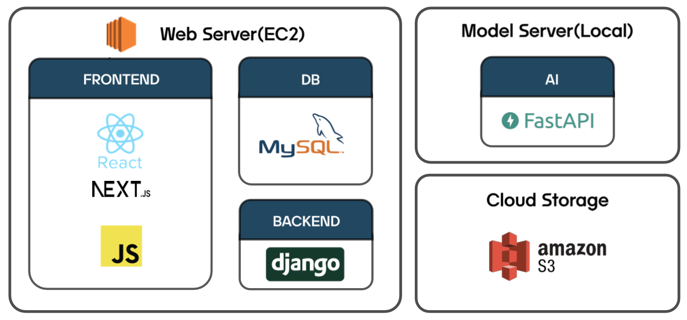
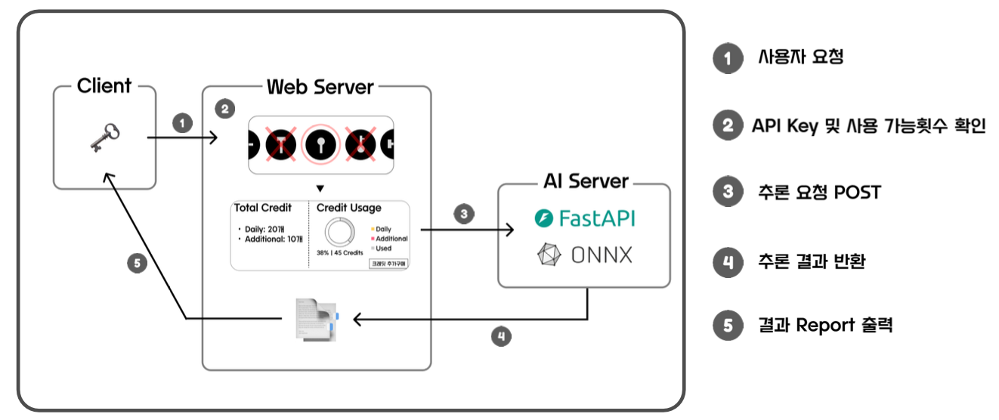
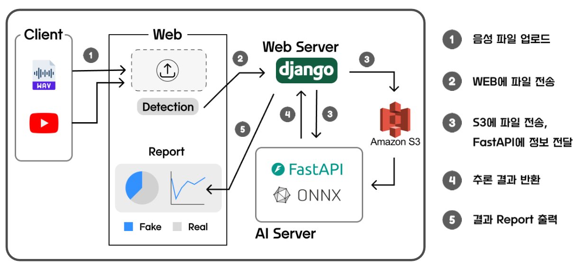

# Voice Verity
__Deep Voice Classification API Service Development Project__

## 프로젝트 개요

생성형 AI 기술의 발전과 함께 Voice Cloning 기술 및 시장도 확대되고 있다. 이 Voice Cloning 기술을 통해 생성된 합성 음성은 실제 인간의 음성을 매우 가깝게 모방할 수 있어 KT의 “AI 보이스 스튜디오”, SM엔터테인먼트의 “aespa 가상멤버 ae-Aespa”, 빅스비의 “Bixby Voice Creator” 등 금융, 통신, 엔터테인먼트 등 다양한 분야에서 적용되는 범위가 확장되고 있다.

그러나 합성 음성을 이용한 피싱, 저작권 침해 등의 범죄도 증가하고 있다. 합성 음성을 악용하여 전화 사기나 금융 사기 같은 피싱 공격을 수행할 수 있으며, 다른 사람의 목소리를 도용하여 저작권을 침해하는 사례도 발생할 수 있다. 이러한 기술의 남용을 방지하기 위해서는 법적 규제와 기술적 방어 체계를 강화하는 것이 필요하며, 사용자 교육을 통해 합성 음성을 판별하는 방법을 널리 알리는 것도 중요하다. 음성 합성 기술이 안전하고 책임감 있게 사용되도록 지속적인 모니터링과 관리가 요구된다.

또한, 현재는 합성 음성인 딥보이스에 대한 대비책이 부족한 상황이다. 사람들은 모르는 전화는 받지 않기, 진위 여부 확인하기, 경찰에 문의하기 등의 방법으로 대응하고 있지만, 이는 일시적인 해결책에 불과하다. 이러한 방법들은 완벽하지 않으며, 실제 피해를 예방하기에는 한계가 있다. 따라서, 체계적이고 기술적인 방어 체계와 법적 규제를 마련하는 것이 필요하며, 사용자의 인식과 교육도 중요한 요소로 작용해야 한다.

그래서 우리는 딥보이스를 탐지하는 서비스를 개발하여 사람들이 조심하는 것이 아니라, 사람들에게 알려주어서 범죄로부터 피해를 입지 않도록 도와주고자 한다. 이 서비스는 합성 음성을 실시간으로 탐지하여 사용자에게 경고를 제공하며, 잠재적인 위험을 예방하는 데 도움을 줄 것이다. 이를 통해 사람들은 더 안전하게 기술을 사용할 수 있을 것이다.

### 기술적 접근 방법
이 프로젝트는 세 가지 주요 기술을 활용하여 딥 페이크 음성을 감지합니다:
1. **RVC 모델**: 음성 변환을 통해 다양한 인구 통계학적 특성을 반영한 합성 음성을 생성합니다.
2. **Vocal Remover 모델**: autoencoder 기반의 모델을 사용하여 음성 데이터에서 배경 노이즈를 제거하고 인간 음성만을 추출합니다.
3. **ViT 모델**: Vision Transformer를 사용하여 음성 데이터를 멜-스펙트로그램 이미지로 변환한 후 딥 페이크 음성을 감지합니다.

## 프로젝트 목표

본 프로젝트의 주요 목표는 딥보이스를 감지할 수 있는 정확하고 신뢰할 수 있는 분류기를 개발하는 것이다. 이를 위해 우리는 고급 인공지능 모델을 활용하여 배포할 것이다. 이 목표를 이루기 위하여 딥보이스를 생성하는 RVC(Retrieval-based Voice Conversion) 모델, 음성 데이터에서 화자의 음성과 배경음과 같은 잡음을 분리하는 Vocal Remover 모델, 실제 음성과 합성 음성을 학습하여 분류하는 Vision Transformer(ViT) 모델을 통해 구분하고자 한다.

### 성능 목표
본 프로젝트의 성능 목표는 다음과 같습니다:
1. **정확도**: 딥 페이크 음성 감지 정확도 98% 이상 달성
2. **실시간 처리**: 1분 이하의 짧은 지연 시간으로 실시간 감지 가능
3. **사용자 만족도**: 사용자 피드백을 통한 90% 이상의 만족도 달성

## 프로젝트 수행 단계

1. 한국어 딥보이스 데이터셋 구축
2. 음성 데이터 전처리
3. 분류 모델 학습
4. 웹 서비스 구현
5. API 형식으로 모델 배포

## 1. 한국어 딥보이스 데이터셋 구축

기존에 한국어 딥 페이크 음성을 포함하는 데이터셋이 부족하기 때문에, 우리는 직접 데이터셋을 생성하기로 결정했다. 이를 위해 오픈소스 라이브러리인 Applio의 RVC Model을 사전학습하여 다양한 성별, 연령대, 지역 방언 및 발화 특성을 포함한 다양한 인구 통계를 대표하는 합성 음성을 생성하여 데이터셋을 구축했다.

실제 음성 데이터는 AI Hub에서 “뉴스 대본 및 앵커 음성 데이터”, “자유대화 음성 (혼합 성별, 어린이)”, “자유대화 음성 (노인, 혼합 성별)”, “자유대화 음성 (일반인, 혼합 성별)“의 4개 카테고리의 데이터를 활용하여 성별, 연령대, 지역 방언 및 발화 특성에 따른 인구 통계학적으로 다양성을 두어 6개의 군집으로 실제 음성 데이터를 수집했다.

### 딥보이스 생성 과정

1. RVC 모델 훈련: 한국어 지원이되는 사전 학습된 모델의 가중치를 호출하여 각 화자에 대한 음성 데이터로 부터 발화 특성을 학습한다.
2. 각 화자의 RVC 모델에 화자별로 다르게 배정한 음성 샘플을 입력으로 하여 합성 음성 샘플을 획득한다.
3. 획득한 합성 음성 샘플이 현실적이고 고품질인지 정성적으로 품질 관리하여 선별한다.

### 한국어 딥보이스 데이터셋 구축량

|한국어 딥보이스 데이터셋|실제 음성|합성 음성|
|------|---|---|
|소아(남)|120|92|
|소아(여)|210|124|
|성인(남)|420|286|
|성인(여)|570|458|
|노인(남)|150|127|
|노인(여)|150|141|
|전체|1620|1554|

## 2. 음성 데이터 전처리

음성 데이터 전처리는 모델 학습의 성능을 극대화하기 위해 매우 중요한 단계이다. 이 과정에서는 수집된 실제 음성과 합성 음성 데이터를 정리하고, 모델이 학습할 수 있는 형태로 변환한다.

### 전처리 과정

1. **노이즈 제거 및 음성 추출**: autoencoder 구조의 Vocal Remover 모델을 사용하여 오디오 신호에서 인간의 음성을 추출한다. 이 모델은 오디오 신호에서 배경 노이즈를 제거하고, 명확한 음성 데이터를 확보할 수 있게 한다.
2. **음성 세분화**: 추출된 음성 데이터를 1초 간격으로 슬라이싱하여 관리 가능한 길이의 오디오 클립으로 분할한다. 이 과정을 통해 모델이 더 작은 단위의 음성 데이터를 효과적으로 처리할 수 있게 한다.
3. **형식 변환**: 각 슬라이스된 오디오 클립을 멜-스펙트로그램으로 변환한다. 멜-스펙트로그램은 음성 데이터를 시각적으로 표현하는 방법으로, 주파수 영역의 정보를 포함하고 있어 모델이 음성의 특징을 더 잘 학습할 수 있도록 돕는다.

### 전처리 후 결과

전처리 과정을 통해 정제된 음성 데이터는 모델 학습에 최적화된 형태로 준비된다. 이렇게 전처리된 데이터는 다음 단계인 분류 모델 학습에 사용되며, 모델의 성능과 정확도를 높이는 데 기여한다.

## 3. 분류 모델 학습

분류 모델 학습 단계에서는 전처리된 데이터를 사용하여 실제 음성과 딥 페이크 음성을 구별할 수 있는 모델을 개발하고 훈련한다. 이 과정에서 우리는 비전 트랜스포머(ViT) 모델을 활용한다. ViT 모델은 이미지 분류 작업에서 높은 성능을 보여주며, 음성 데이터를 멜-스펙트로그램으로 변환하여 사용함으로써 음성 분류 작업에도 효과적으로 적용될 수 있다.

### Vision Transformer (ViT) 모델 설명

ViT 모델은 전통적인 합성곱 신경망(CNN)과는 다른 접근 방식을 사용하여 이미지를 분류하는 모델이다. 트랜스포머 아키텍처를 사용하여 이미지를 처리하며, 이는 자연어 처리(NLP)에서 주로 사용되던 트랜스포머를 이미지 도메인으로 확장한 것이다. ViT는 여러 가지 측면에서 혁신적이며, 특히 대규모 데이터셋에서 강력한 성능을 발휘한다.
(https://arxiv.org/pdf/2010.11929)

#### ViT 모델의 주요 구성 요소

1. **패치 분할 (Patch Embedding)**: 입력 이미지(여기서는 멜-스펙트로그램 이미지)를 고정된 크기의 패치로 분할한다. 예를 들어, 256x256 크기의 이미지를 16x16 크기의 패치로 분할하면 총 256개의 패치가 생성된다. 각 패치는 1차원 벡터로 변환된다.
2. **위치 인코딩 (Position Embedding)**: 패치가 순서에 따라 배열되므로 각 패치의 위치 정보를 인코딩해야 한다. 위치 인코딩을 추가하여 패치의 순서 정보를 모델에 제공한다.
3. **트랜스포머 인코더 (Transformer Encoder)**: 트랜스포머 인코더는 다중 헤드 자가 주의(Multi-Head Self-Attention) 메커니즘과 피드 포워드 네트워크로 구성된다. 각 패치는 자가 주의 메커니즘을 통해 다른 패치와의 관계를 학습하며, 피드 포워드 네트워크를 통해 비선형 변환이 적용된다. 트랜스포머 인코더는 이러한 과정을 여러 번 반복하여 입력 패치의 복잡한 패턴을 학습한다.
4. **클래스 토큰 (Class Token)**: 분류를 위해 클래스 토큰을 추가한다. 클래스 토큰은 학습 과정에서 트랜스포머 인코더를 통해 다른 패치와 상호작용하며 최종적으로 이미지의 전체 정보를 요약하는 역할을 한다.
5. **MLP 헤드 (MLP Head)**: 트랜스포머 인코더의 출력을 입력으로 받아 최종 분류를 수행하는 다층 퍼셉트론(MLP) 레이어이다. 여기서 모델은 실제 음성과 딥 페이크 음성을 구별하는 확률을 출력한다.

### ViT 모델 학습 과정

1. **데이터 준비**: 전처리된 멜-스펙트로그램 이미지를 학습 데이터와 검증 데이터로 분할한다. 각 데이터에는 실제 음성과 딥 페이크 음성의 라벨이 포함된다.
2. **모델 초기화**: 처음부터 학습을 시작하기 위해 모델을 초기화한다.
3. **학습 설정**: 학습률, 배치 크기, 에포크 수 등의 학습 하이퍼파라미터를 설정한다. 또한, 교차 엔트로피 손실 함수와 Adam 옵티마이저를 사용하여 모델을 학습시킨다.
4. **모델 훈련**: 학습 데이터셋을 사용하여 모델을 훈련시킨다. 이 과정에서 모델은 입력 데이터를 통해 패치 분할, 위치 인코딩, 트랜스포머 인코더를 거쳐 최종적으로 MLP 헤드를 통해 분류 결과를 도출한다. 모델의 성능은 검증 데이터셋을 사용하여 주기적으로 평가한다.
5. **모델 평가**: 검증 데이터셋을 사용하여 모델의 성능을 평가한다. 평가 지표로는 정확도(Accuracy), 정밀도(Precision), 재현율(Recall), F1-점수(F1-Score) 등이 사용된다.
6. **모델 저장 및 배포**: 훈련이 완료된 모델을 저장하고, ONNX 형식으로 변환하여 배포한다. 이를 통해 실시간 딥 페이크 음성 감지 응용 프로그램에 모델을 통합할 수 있다.

### 결론

ViT 모델을 활용하여 딥 페이크 음성을 감지하는 접근 방식은 기존의 CNN 기반 모델보다 더 높은 정확도와 효율성을 제공할 수 있다. 멜-스펙트로그램 이미지를 입력으로 사용함으로써, ViT 모델은 음성 데이터의 시각적 특징을 효과적으로 학습하고, 이를 통해 실제 음성과 딥 페이크 음성을 정확하게 구별할 수 있다. 이 과정에서 높은 품질의 전처리와 적절한 하이퍼파라미터 설정이 중요한 역할을 한다.

## 4. 웹 서비스 구현

본 프로젝트에서는 딥 페이크 음성 감지 모델을 효과적으로 활용하기 위해 웹 서비스를 구현하였다. 이 웹 서비스는 사용자 친화적인 인터페이스를 제공하며, 사용자가 음성 데이터를 업로드하고 실시간으로 딥 페이크 여부를 확인할 수 있도록 한다. 웹 서비스 구현에 사용된 주요 기술과 구성 요소는 다음과 같다.

### Web Server

웹 서버는 아마존 EC2(Amazon Elastic Compute Cloud)를 이용하여 구축하였다. 아마존 EC2는 확장 가능하고 유연한 컴퓨팅 리소스를 제공하여, 웹 서비스의 트래픽 증가에도 안정적으로 대응할 수 있다.

### 사용자 흐름
웹 서비스는 다음과 같은 사용자 흐름을 따릅니다:
1. **회원 가입 및 로그인**: 사용자는 서비스에 가입하고 로그인합니다.
2. **음성 파일 업로드**: 사용자는 음성 파일이나 유튜브 링크를 업로드합니다.
3. **딥 페이크 감지 요청**: 업로드된 파일을 분석 요청합니다.
4. **결과 확인**: 분석 결과가 사용자에게 제공되며, 딥 페이크 여부를 확인할 수 있습니다.
5. **추가 기능**: 사용자는 결과에 대한 상세 보고서를 다운로드하거나, 추가 분석을 요청할 수 있습니다.

### Frontend

프론트엔드는 사용자 인터페이스를 구성하는 부분으로, React, Next.js, JavaScript를 사용하여 구현하였다.

- **React**: React는 컴포넌트 기반의 UI 라이브러리로, 복잡한 사용자 인터페이스를 효과적으로 구축하고 관리할 수 있다.
- **Next.js**: Next.js는 React 기반의 프레임워크로, 서버 사이드 렌더링(SSR)과 정적 사이트 생성(SSG)을 지원하여 빠르고 SEO 친화적인 웹 애플리케이션을 만들 수 있다.
- **JavaScript**: JavaScript는 웹 애플리케이션의 동적 기능을 구현하는 데 사용되었다.

### Database(DB)

데이터베이스는 MySQL을 사용하여 구축하였다. MySQL은 안정적이고 성능이 뛰어난 관계형 데이터베이스 관리 시스템(RDBMS)으로, 사용자 정보 등의 메타데이터를 저장하는 데 사용된다.

### Backend

백엔드는 Django 프레임워크를 사용하여 구현하였다. Django는 파이썬 기반의 웹 프레임워크로, 빠르고 효율적인 웹 개발을 지원하며, 다양한 내장 기능을 제공하여 백엔드 로직을 쉽게 구현할 수 있다.

### Model Server

모델 서버는 딥 페이크 음성 감지 모델을 ONNX 형식으로 구동하기 위해 FastAPI를 사용하여 구현하였다. FastAPI는 고성능의 비동기 파이썬 웹 프레임워크로, 실시간 음성 데이터 처리를 효율적으로 수행할 수 있다.

모델 서버는 GPU Tesla V100이 장착된 로컬 서버에서 운영된다. Tesla V100 GPU는 높은 연산 능력을 제공하여, 대규모 데이터 처리와 실시간 추론 작업을 빠르게 수행할 수 있다.

### Cloud Storage

사용자가 업로드한 음성 데이터 파일은 AWS S3(Amazon Simple Storage Service)에 저장된다. AWS S3는 확장 가능하고 보안이 강화된 객체 스토리지 서비스로, 대용량 파일을 효율적으로 저장하고 관리할 수 있다.

## 5. API 형식으로 모델 배포

### API Flow

이 API 플로우 다이어그램은 사용자가 웹 서비스를 통해 음성 파일 또는 유튜브 링크를 업로드하여 딥 페이크 음성을 감지하는 전체 과정을 설명한다. 각 단계는 다음과 같다:

1. **사용자 요청 (Client Request)**: 사용자는 클라이언트를 통해 음성 파일 또는 유튜브 링크를 웹 서버에 업로드한다. 이때, 사용자 요청에는 API 키와 같은 인증 정보가 포함된다.
2. **API Key 및 사용 가능 횟수 확인 (API Key and Usage Verification)**: 웹 서버는 사용자의 API 키를 확인하고, 해당 사용자의 요청 가능 횟수를 체크한다. 이는 사용자의 인증과 서비스 사용량을 관리하기 위함이다.
3. **추론 요청 POST (Inference Request POST)**: 웹 서버는 검증된 API 키와 함께 사용자가 업로드한 음성 파일의 경로 또는 유튜브 링크를 AI 서버에 POST 요청으로 전달한다. 이 요청은 FastAPI를 통해 처리된다.
4. **추론 결과 반환 (Return Inference Result)**: AI 서버는 전달받은 경로 또는 링크를 통해 AWS S3에서 음성 파일을 다운로드하거나 유튜브 링크에서 영상을 추출한다. 이후, 데이터를 전처리하고 ONNX 모델을 사용하여 딥 페이크 여부를 추론한다. 추론 결과는 웹 서버로 반환된다.
5. **결과 Report 출력 (Result Report Output)**: 웹 서버는 AI 서버로부터 받은 추론 결과를 클라이언트에 전달한다. 사용자는 웹 인터페이스를 통해 결과 보고서를 확인할 수 있다. 이 보고서는 사용자의 요청이 성공적으로 처리되었음을 보여주며, 딥 페이크 여부에 대한 분석 결과를 포함한다.

#### API Flow Summary

- **사용자 요청**: 사용자가 음성 파일이나 유튜브 링크를 업로드.
- **인증 및 검증**: 웹 서버에서 API 키와 요청 가능 횟수 확인.
- **AI 서버로 요청 전송**: FastAPI를 통해 음성 파일 경로 또는 유튜브 링크를 AI 서버로 POST 요청.
- **AI 서버 처리**: 음성 파일을 다운로드하거나 유튜브 링크에서 영상을 추출하여 ONNX 모델로 추론 수행.
- **결과 반환 및 보고**: 추론 결과를 웹 서버로 반환하고, 사용자는 결과 보고서를 웹 인터페이스에서 확인.

이 흐름을 통해 사용자는 딥 페이크 음성 감지 서비스를 효율적으로 이용할 수 있다. 각 단계는 안전하고 신뢰성 있게 설계되어, 사용자 경험을 최적화하며 실시간으로 정확한 결과를 제공한다.

### Preview Flow

프리뷰 기능을 추가하여 사용자들이 서비스를 직접 체험해 볼 수 있도록 개발하였다. 이 기능을 통해 사용자는 음성 파일이나 유튜브 링크를 웹 서버에 업로드할 수 있다. 이후 전체 흐름은 다음과 같다:

1. **사용자 입력**: 사용자가 음성 파일을 업로드하거나 유튜브 링크를 입력한다.
2. **파일 업로드**: 웹 서버는 사용자가 업로드한 음성 파일을 AWS S3에 저장한다. 유튜브 링크의 경우, 해당 링크를 AWS S3에 저장할 필요는 없으며, 링크 정보를 그대로 사용한다.
3. **모델 서버 호출**: 웹 서버는 저장된 파일의 경로 또는 유튜브 링크를 모델 서버에 전달한다.
4. **파일 처리**:
  - 모델 서버는 전달받은 파일 경로를 통해 AWS S3에서 음성 파일을 다운로드하거나, 유튜브 링크를 통해 영상을 추출한다.
  - 다운로드한 파일이나 추출한 음성 데이터를 전처리하여 분석 준비를 한다.
5. **모델 추론**: 전처리된 데이터를 ONNX 모델에 입력하여 딥 페이크 음성 여부를 추론한다.
6. **결과 반환**: 추론 결과를 웹 서버로 반환한다.
7. **결과 표시**: 웹 서버는 추론 결과를 사용자에게 시각적으로 표시하여, 음성이 딥 페이크인지 여부를 확인할 수 있도록 한다.

이 프리뷰 기능을 통해 사용자는 딥 페이크 음성 감지 서비스를 직접 경험하고, 그 성능을 확인할 수 있다. 이 과정에서 AWS S3, 모델 서버, ONNX 모델 등을 활용하여 실시간으로 추론 결과를 제공한다.

## 결론

본 프로젝트에서는 딥 페이크 음성 감지 서비스를 제공하기 위해 종합적인 웹 서비스를 개발하였다. 전체 시스템은 프론트엔드, 백엔드, 모델 서버 및 데이터 저장소 간의 효율적인 통합을 통해 사용자에게 신뢰성 있는 딥 페이크 감지 결과를 제공한다.

웹 서버는 아마존 EC2를 기반으로 구축되었으며, 사용자 인터페이스는 React와 Next.js로 구현되어 직관적이고 사용자 친화적이다. 데이터베이스는 MySQL을 사용하여 안정적인 데이터 저장 및 관리를 보장한다. Django를 사용한 백엔드는 효율적인 API 요청 처리를 지원한다.

모델 서버는 FastAPI를 이용하여 구축되었으며, GPU Tesla V100이 장착된 로컬 서버에서 고성능 ONNX 모델을 구동한다. 이 모델 서버는 실시간으로 사용자 요청을 처리하여 음성 데이터의 딥 페이크 여부를 추론한다. 또한, AWS S3를 활용하여 대용량 음성 파일을 안전하게 저장하고 관리한다.

프리뷰 기능을 통해 사용자는 음성 파일이나 유튜브 링크를 업로드하여 실시간으로 딥 페이크 감지 결과를 체험할 수 있다. 이 기능은 AWS S3와 모델 서버 간의 원활한 통합을 통해 빠르고 정확한 결과를 제공한다.

본 시스템은 높은 정확도와 성능을 자랑하는 ViT 모델을 활용하여 딥 페이크 음성을 효과적으로 감지한다. 이를 통해 보안, 인증 및 미디어 검증과 같은 다양한 응용 분야에서 유용하게 활용될 수 있다. 향후 작업으로는 모델의 추가 최적화 및 사용자 경험을 개선하기 위한 기능 확장을 고려하고 있다.

본 프로젝트를 통해 구축된 딥 페이크 음성 감지 웹 서비스는 사용자에게 강력한 도구를 제공하여, 딥 페이크 기술의 확산으로 인한 잠재적 위험을 효과적으로 대응할 수 있게 한다. 이는 향후 보안 및 신뢰성 있는 디지털 커뮤니케이션을 위한 중요한 기반이 될 것이다.
